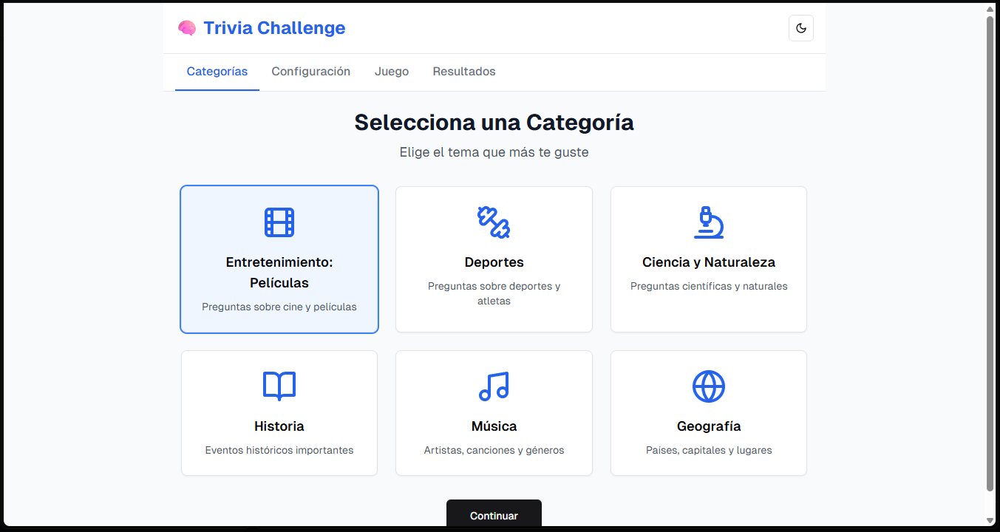
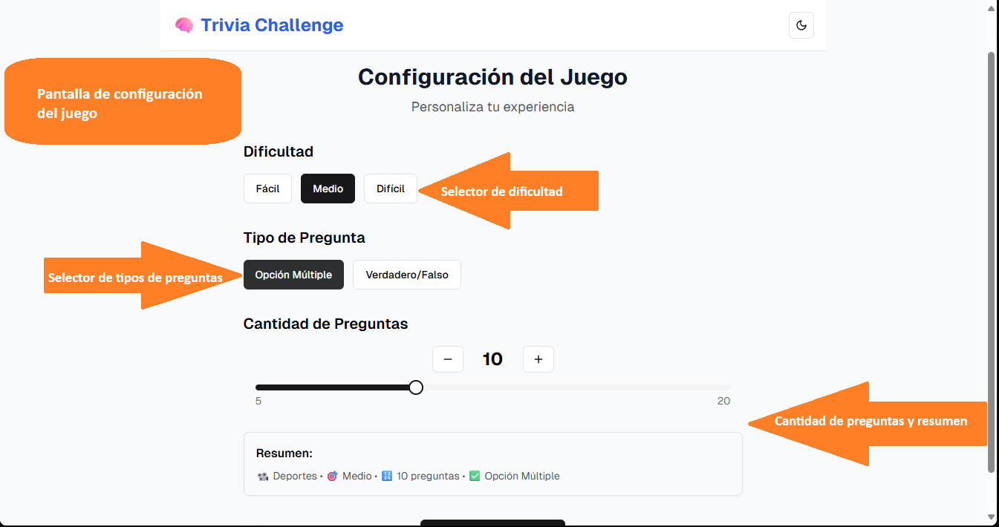
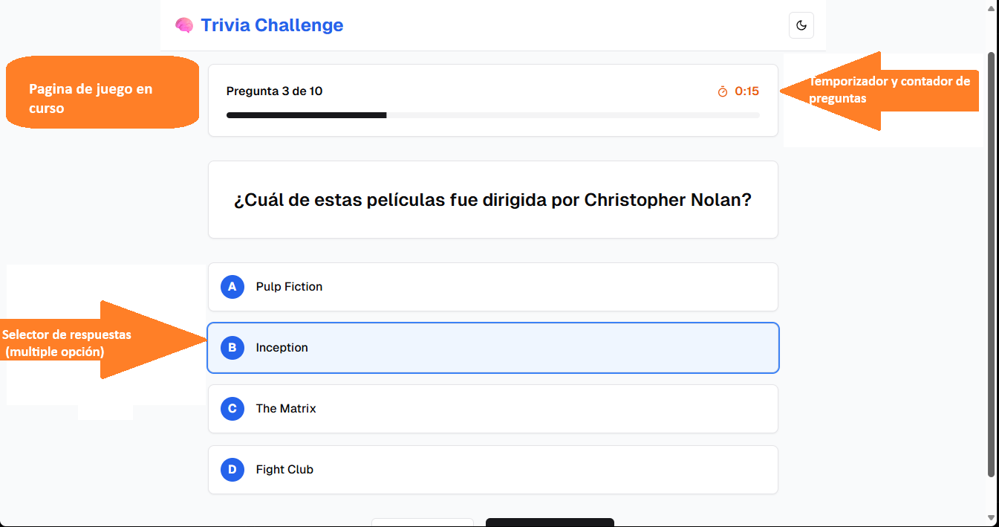

# TriviaApp 🎮

Aplicación de trivia desarrollada con [Angular CLI](https://github.com/angular/angular-cli) versión 20.0.0.

## 📖 Descripción

Esta aplicación permite seleccionar categorías de preguntas, configurar la trivia según preferencias personales y jugar contra reloj. Al finalizar, presenta resultados y estadísticas claras para evaluar tu desempeño.

## 📦 Estructura del Proyecto

El proyecto está compuesto por los siguientes componentes principales:

- `CategorySelectorComponent`: selección de categoría de preguntas.
- `GameSetupComponent`: configuración previa al juego (sonido, temporizador, dificultad, tipo de preguntas).
- `TriviaGameComponent`: ejecución del juego, muestra preguntas y controla lógica.
- `GameResultsComponent`: muestra resultados del juego una vez finalizado.

## 📌 Requisitos previos

- Node.js (versión recomendada: 18 o superior)
- Angular CLI versión 20

## ⚙️ Instalación del proyecto

Cloná el repositorio e instalá las dependencias con los siguientes comandos:

```bash
git clone [URL_REPO]
cd trivia-app
npm install
```

## 🚀 Desarrollo y ejecución

1. Instalá las dependencias del proyecto:

   ```bash
   npm install
   ```

2. Iniciá un servidor de desarrollo local:

   ```bash
   ng serve
   ```

3. Abrí tu navegador en `http://localhost:4200/`. La aplicación se recargará automáticamente al guardar cambios en los archivos fuente.

## 🛠️ Construcción para despliegue

Para compilar el proyecto en modo producción:

```bash
ng build
```

Los artefactos generados se almacenan en `dist/`. Este build está optimizado para rendimiento.

## 🔧 Scaffolding de componentes

Podés generar nuevos componentes utilizando Angular CLI:

```bash
ng generate component NombreDelComponente
```

Para ver todas las opciones disponibles:

```bash
ng generate --help
```


## 🖼️ Mockup de la aplicación




## 🧪 Testing

### Tests unitarios

Para ejecutar los tests unitarios con [Karma](https://karma-runner.github.io):

```bash
ng test
```

### Tests end-to-end (E2E)

Para pruebas de extremo a extremo:

```bash
ng e2e
```

ℹ️ Angular CLI no incluye framework E2E por defecto. Podés integrar herramientas como Cypress o Playwright si lo necesitás.

## 🧭 Flujo de la Aplicación

A continuación, se muestran imágenes del flujo típico dentro de la aplicación:

1. **Pantalla de selección de categoría**
   

2. **Configuración de trivia**
   

3. **Juego de trivia en ejecución**
   

4. **Pantalla de resultados**
   

## 📂 Estructura detallada

```
├── src/
│   └── app/
│       ├── core/              # Lógica y modelos
│       ├── features/trivia/   # Pantallas principales
│       └── shared/components/ # Componentes UI reutilizables
└── mockup/                    # Referencias visuales
```

## 📚 Recursos adicionales

- [Angular CLI Docs](https://angular.dev/tools/cli)
- [Angular Component Interaction](https://angular.io/guide/component-interaction)
- [Angular Routing & Navigation](https://angular.io/guide/router)

---

## 🎲 Cómo jugar

Consulta el archivo [README-gameplay.md](README-gameplay.md) para obtener información detallada sobre cómo disfrutar al máximo del juego, reglas, y detalles para usuarios finales.
